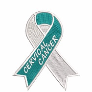

# Cervical Cancer Prediction Using Machine Learning Algorithm (XGBOOST)

# Hey There!,

In May 2023, i went for my usual yearly checkup at the hospital and i was advised to schedule for a Pap test. I was confused initally!?

# What is a Pap test?

A Pap test, also known as a Pap smear or cervical cytology, is a screening test used to detect abnormal cells in the cervix, the lower part of the uterus that connects to the vagina. The test is primarily conducted to identify early signs of cervical cancer or precancerous conditions

My appointment was schedule in June and yes! it went smoothly.

# Did you know
Cervical cancer kills 4000 women in the US and 300,000 women worldwide!. However due to early medical screening, cervical cancer rate has been reduced by 74% from 1955 to 1992.

Early detection indeed counts!

Shortly after my appointmnet i began my summer elective, which was a refresher course " Introduction to R programming langauge". 

One of the things i learned off the course was the use of Machine learning algorithms(Decision tree and random forest) for prediction. I went researching and found a Machine learning course on coursera on Cervical cancer, what are the odds!

Here is a break down of how the analysis went

Programming langaug: Python
Environment: Jupyter Notebook

Dataset:  [Download File](https://raw.githubusercontent.com/Moyoshabz/Cervical_Cancer_Prediction/main/cervical_cancer.csv)

## Exploratory Data Analysis (EDA)

