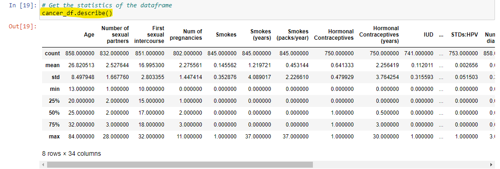
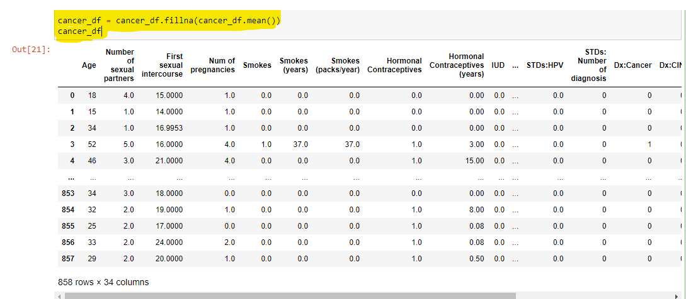

# Cervical Cancer Prediction Using Machine Learning Algorithm (XGBOOST)

# Hey There!,

In May 2023, i went for my usual yearly checkup at the hospital and i was advised to schedule for a Pap test. I was confused initally!?

# What is a Pap test?

A Pap test, also known as a Pap smear or cervical cytology, is a screening test used to detect abnormal cells in the cervix, the lower part of the uterus that connects to the vagina. The test is primarily conducted to identify early signs of cervical cancer or precancerous conditions

My appointment was schedule in June and yes! it went smoothly.

# Did you know
Cervical cancer kills 4000 women in the US and 300,000 women worldwide!. However due to early medical screening, cervical cancer rate has been reduced by 74% from 1955 to 1992.

Early detection indeed counts!

Shortly after my appointmnet i began my summer elective, which was a refresher course " Introduction to R programming langauge". 

One of the things i learned off the course was the use of Machine learning algorithms(Decision tree and random forest) for prediction. I went researching and found a Machine learning course on coursera on Cervical cancer, what are the odds!

Here is a break down of how the analysis went

Programming langaug: Python
Environment: Jupyter Notebook

Dataset:  [Download File](https://raw.githubusercontent.com/Moyoshabz/Cervical_Cancer_Prediction/main/cervical_cancer.csv)

## Exploratory Data Analysis (EDA)

## Data Cleaning Process before Analysis and Prediction

# Identifying missing values

## Observation: They are instances of *?* in some of the columns such as First Sexual Intercourse and STD Time

## Action: Replacing every instance of *?* with nan, to avoid skewness during the analysis and prediction phase

### Next is to identify Null values in the dataset

## Action: Using a Viualization such as a Heatmap can help identify null values 

### It is observed from that line of code that 2 colums have a lot of null values. This columns are STDS:Time since first diagnosis and time since lst dignosis

## Action: The best strategy is to drop that columns so it doesn't skew our analysis

# Understanding the data type

### Since most of the column types are object, we are not able to get the statistics of the dataframe. 

## Action: Convert them to numeric type

## Observation: After converting the datatype to float, we can see a differences in the Statistic before and after rectifying the datatype

### Old Statistics

### New Statistics

## Data Cleaning using Mean imputation

### After mean imputation visulaize the dataset using a heatmap to identify if the imputation worked

# Answer Questions with the dataset on Canncer predicton

